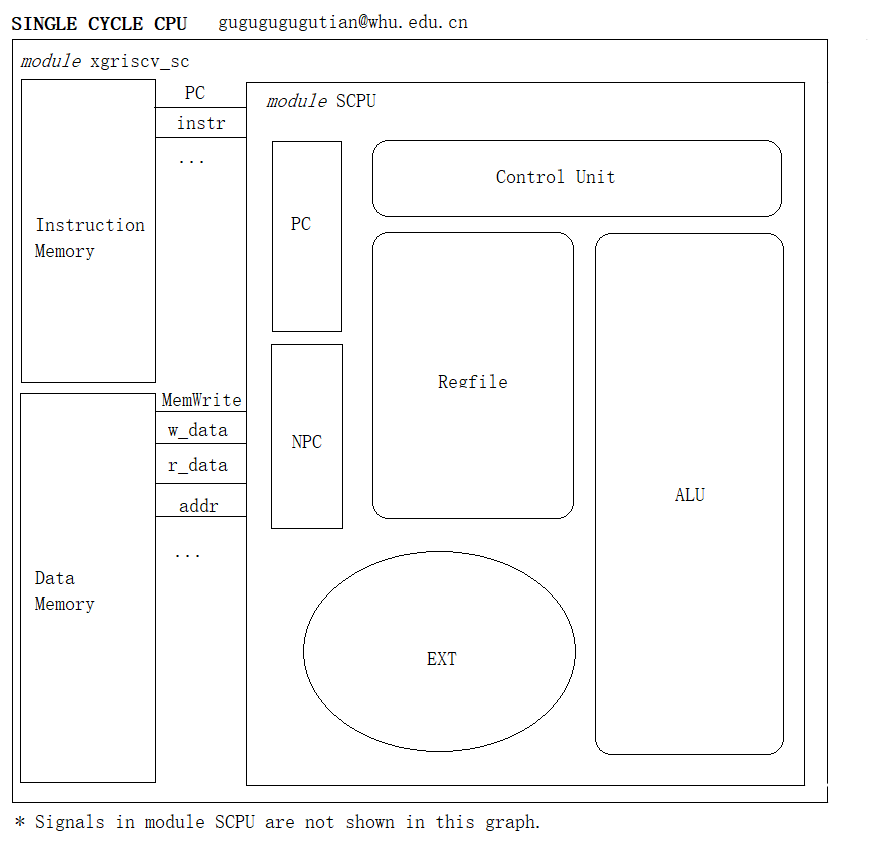

# WHU-SingleCycleCPU-RISC-V
 武汉大学计算机组成与设计课程单周期CPU处理器实现，使用RISC-V语言实现。
 
 本代码在给出的CPU框架和一些基本模块的基础上，实现了较为完整功能的单周期处理器读取指令、译码、内存读写等操作。

 # 特别提醒

    请注意：本代码供学习参考，请独立完成作业。
    直接提交本代码，很有可能造成查重不通过，请自行承担后果。

# Release说明
## full-SC
Release包含基础的CPU模块。如果需要提交到在线平台进行验证，那么可以直接使用。
## 本地仿真
本模块可以在ModelSim等软件上完成仿真，您可以使用xgriscv_tb.v文件实现。另外，您需要自行用RISC-V指令集汇编一个名为riscv32_sim_all.hex的二进制文件，放在仿真文件的项目中。
## 联系作者
除了Github外，您可通过gugugugugutian@whu.edu.cn邮箱联系。

# 模块介绍
## alu.v
处理器中的运算逻辑单元。根据控制单元生成的操作数等信号产生不同的结果。

Arithmetic and logic computing unit in CPU. The result of ALU differs with ALUOp and other signals generated from control unit. 
## ctrl_encode_def.v
预定义一些常用的控制信号。

Pre-definitions of common control signals. 
## ctrl.v
控制单元。根据指令产生控制信号。

Control unit. Generates control signals according to instruction input. 
## EXT.v
立即数生成单元。除了生成12位立即数外还能扩展位数。

Generates and expands immediate numbers.
## NPC.v
下一个PC。类似多路选择门的作用，同时用pcW将pc的值输出到测试文件。

Next PC. It is similar to MUX to select address to PC. Besides, it outputs the current value of PC to testbench using:

    output pcW;

## PC.v
程序计数器。

Process counter. 
## RegFile.v
寄存器堆。写寄存器时显示执行的操作。

Register file. When register is changed, the operation would be displayed. 
## SCPU.v
单周期处理器。这个模块中连接寄存器、控制单元、ALU等。

Single cycle CPU which connects register file, control unit and ALU modules together. 
## xgriscv_mem.v
数据存储和指令存储。

Instruction memory and data memory. 
## xgriscv_sc.v
连接模块。用于CPU和内存的交互。

Connection between CPU and memories. 

## xgriscv_tb.v
测试模块。

Testbench. 

# 模块连接示意图
模块大致的连接示意如图。

Most of the connections between modules are shown below. 

